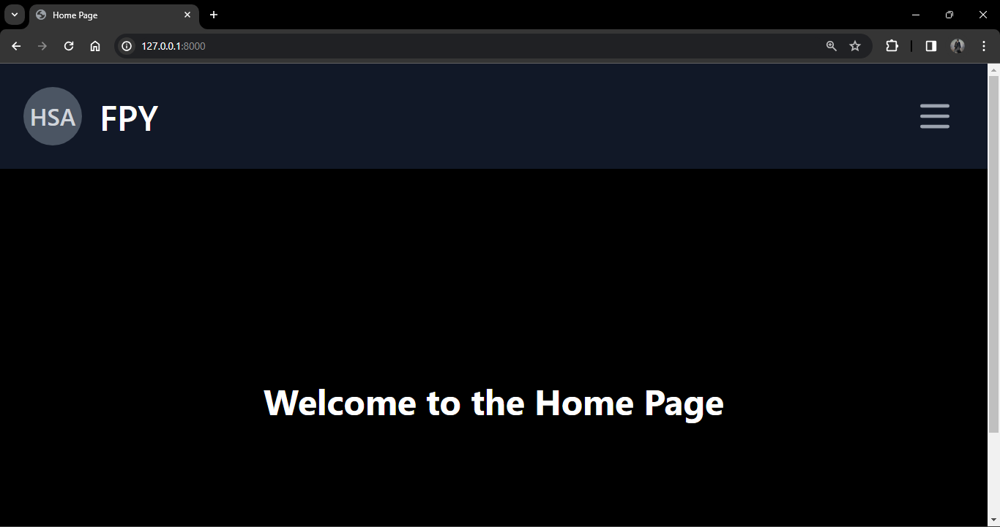
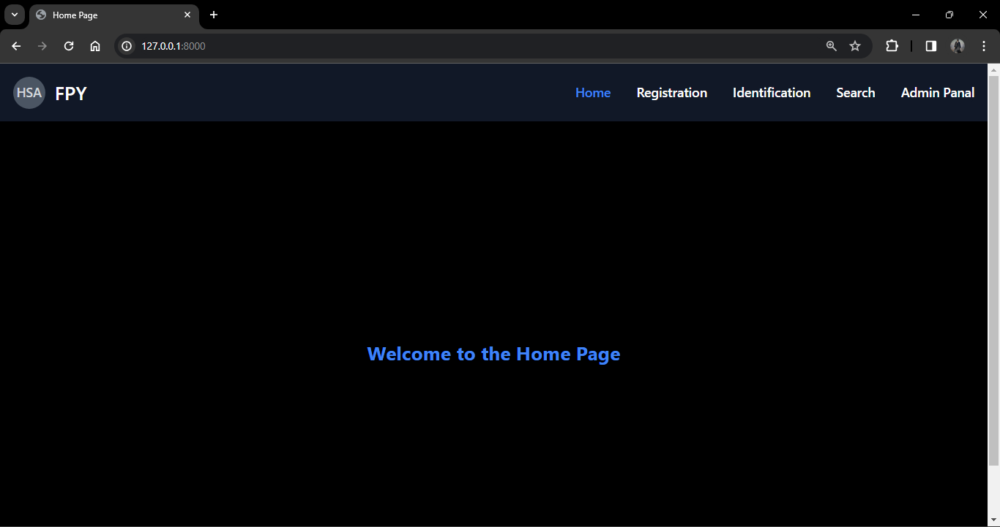
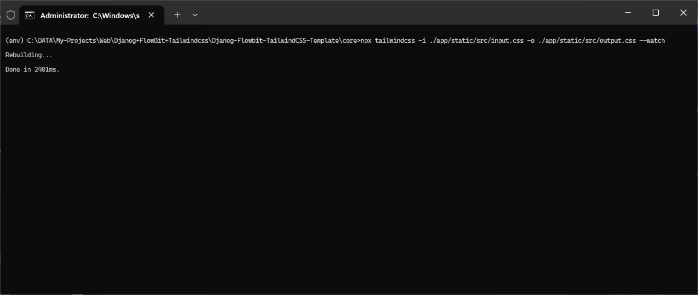
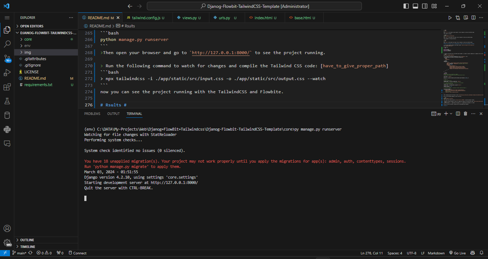

### files after readme are just for github static deployment [Ref to actual working files](https://github.com/Flowbite/flowbite-tailwindcss-template)


# Djanog Flowbit TailwindCSS Template
 This is a ready to use Boiler plate Template for djanog 

### Tags ###
 


 

# Installation #
[_Point_To_Be_noted_] Install node and npx packages after creating djanog project and app.
The only this major thing to do is to install the TailwindCSS and Flowbit and add some config ot settings.py and tailwind.config.js

```bash 
pip install -r requirements.txt
```
```bash
npm install
```
Try running `rm -rf node_modules` and `npm cache clean` and `do npm install` again if you are facing any issues.

First Clean the cache `npm cache clean --force` Then Install It `npm install` 

# If Want to start from scratch #

## Djanog ##

As of today the Long Term Support(LTS) version is 4.2.10  [February 2024]

### Create a virtual environment ###

First, you will need to install `virtualenv` if you don"t have it yet. Its convenient to use virtual environments to keep your dependencies separate and organized.

You can install it via pip:

```bash
pip install virtualenv
```
Then to create a new virtual environment, run the following command:

```bash
virtualenv env
```
Where `env` is the name of your virtual environment. You can replace it with your preferred name.

Then to activate the virtual environment, run the following command:

```bash
source env/bin/activate # for Linux and macOS
env\Scripts\activate # for Windows
```
Where `env` is the name of your virtual environment. You can replace it with your preferred name.

### Install TailwindCSS ###

Now we are going to install LTS version of Django. To do that, run the following command:

```bash
pip install django==4.2.10
``` 

### Install TailwindCSS ###

As recommended by the [TailwindCSS](https://flowbite.com/docs/getting-started/django/#install-flowbite) documentation, we will use `npm` to install TailwindCSS. If you don"t have `npm` installed yet, you can download it from the official website.[Node LTE 20.11.1](https://nodejs.org/dist/v20.11.1/node-v20.11.1-linux-x64.tar.xz)
 
Restart your terminal after installing `npm` to make sure it"s available.
```bash
node -v
```
```bash
npm -v
```
After installing `npm`, you can now install TailwindCSS.
1. Run the following command the install Tailwind CSS as a dev dependency using NPM:
```bash
npm install -D tailwindcss
```
2. Create a TailwindCSS configuration file by running the following command:
```bash
npx tailwindcss init
```
3. Configure the template paths using the content value inside the Tailwind configuration file:

```js
module.exports = {
  content: [
      "./templates/**/*.html"
  ],
  theme: {
    extend: {},
  },
  plugins: [],
}
```


### Install Flowbit ###

Flowbite is an open source library of interactive components built on top of Tailwind CSS and 
it can be installed using NPM and required as a plugin inside Tailwind CSS.

1. Install Flowbite as a dependency using NPM:
```bash
npm install flowbite
```

2. Require Flowbite as a plugin inside the `tailwind.config.js` file:
```js
module.exports = {

    plugins: [
        require("flowbite/plugin")
    ]

}
```
3. Include Flowbite inside the content value of the tailwind.config.js file:
```js
module.exports = {
  content: [
      "./templates/**/*.html",
      "./node_modules/flowbite/**/*.js"
  ],
  theme: {
    extend: {},
  },
  plugins: [],
}
```

{there is a file called tailwind.config.js in the root directory of the project}
{there a catch while configuringit for djanog, the below is on doc of tailwindcss}
{Then below config is have tested and working for djanog}

```js
/** @type {import("tailwindcss").Config} */
module.exports = {
  darkMode: "class",
  darkMode: "media",
  darkMode: "selector", // or "media" or "class" this is for dark mode see doc. or you can ignore it 

  content: [
    "../**/*.html",
    "../node_modules/flowbite/**/*.js",
  ],
  theme: {
    extend: {},
  },
  plugins: [
    require("flowbite/plugin"),
  ],
}
```

4. nclude Flowbite’s JavaScript file inside the _base.html file just before the end of the <body> tag using CDN or by including it directly from the node_modules/ folder:
```html
<script src="https://cdnjs.cloudflare.com/ajax/libs/flowbite/2.3.0/flowbite.min.js"></script>
```
ow that you have everything configured you can check out the components from Flowbite such as navbars, modals, buttons, datepickers, and more.

## Starting a new project ##

To start a new project, run the following command:

```bash
django-admin startproject core
```
Where `core` is the name of your project. You can replace it with your preferred name.

Then navigate to the project directory:

```bash
cd core
```
Where `core` is the name of your project. You can replace it with your preferred name.

Then create a new app:

```bash
python manage.py startapp app
```
Where `app` is the name of your app. You can replace it with your preferred name.

Then navigate to the app directory:

```bash
cd app
```
Where `app` is the name of your app. You can replace it with your preferred name.

### Now we are going to do so configurations to make sure that TailwindCSS is working.

1. Go to your app and create a new folder called `static/src/output.css and input.css` 
and `templates/base.html`:

in input.css
```css

@tailwind base;
@tailwind components;
@tailwind utilities;

```

1.1 There is one more this to do before point number 2, we need to install compressor to compress the css and js files
```bash
pip install django-compressor
```
1.2 Then add the following configuration to the `settings.py` file: 
 Go to Settings.py and add the following configuration:
```python
    "app",
    "compressor",
```
```python
TEMPLATES = [
    {
        "BACKEND": "django.template.backends.django.DjangoTemplates",
        "DIRS": [BASE_DIR / "templates"], # Add this line <<<< this 
        "APP_DIRS": True,
        "OPTIONS": {
            "context_processors": [
                "django.template.context_processors.debug",
                "django.template.context_processors.request",
                "django.contrib.auth.context_processors.auth",
                "django.contrib.messages.context_processors.messages",
            ],
        },
    },
]
```
```python
import os
# Static files (CSS, JavaScript, Images)
# https://docs.djangoproject.com/en/4.2/howto/static-files/

STATIC_URL = "static/"

BASE_DIR = os.path.dirname(os.path.dirname(os.path.abspath(__file__)))

# import os

# Using os.path.join()
COMPRESS_ROOT = os.path.join(BASE_DIR, "static")

# Or using Path.joinpath() if BASE_DIR is a Path object
# from pathlib import Path

COMPRESS_ROOT = Path(BASE_DIR).joinpath("static")

COMPRESS_ENABLED = True

# STATICFILES_FINDERS = ("compressor.finders.CompressorFinder",)

STATICFILES_FINDERS = (
    "django.contrib.staticfiles.finders.FileSystemFinder",
    "django.contrib.staticfiles.finders.AppDirectoriesFinder",
    # other finders..
    "compressor.finders.CompressorFinder",
)
```

After Configuring See the Project It Self [Considering_you_have_basic_knowledge_of_Django_TailwindCSS_and_Flowbite]

Now run the following command to start the server:

```bash
python manage.py runserver
```
>Then open your browser and go to `http://127.0.0.1:8000/` to see the project running.

> Run the following command to watch for changes and compile the Tailwind CSS code: [have_to_give_proper_path]
```bash
> npx tailwindcss -i ./app/static/src/input.css -o ./app/static/src/output.css --watch
```
now you can see the project running with the TailwindCSS and Flowbite.

# Rsults #





